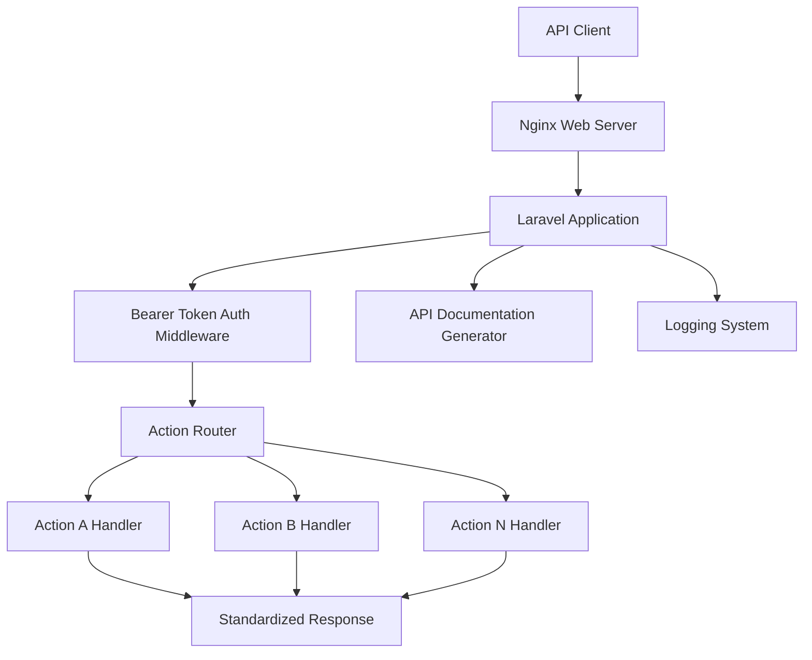
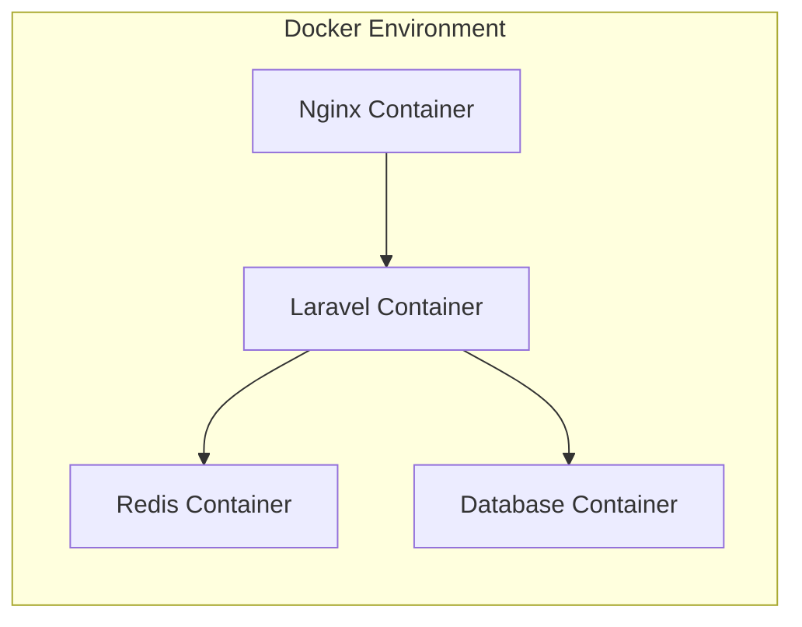

# Design Document

## Overview

本系統設計為一個基於Laravel框架的統一API Server，採用單一入口點架構模式。所有API請求都透過統一的路徑 `/api/` 進入系統，使用POST方法並透過 `action_type` 參數來路由到對應的Action處理器。系統採用Docker容器化部署，使用Nginx作為反向代理，支援Bearer Token驗證機制，並具備自動API文件生成功能。

## Architecture

### 系統架構圖



### 容器架構



## Components and Interfaces

### 1. 核心路由系統

**UnifiedApiController**
- 負責接收所有 `/api/` 路徑的POST請求
- 驗證Bearer Token
- 解析 `action_type` 參數
- 路由到對應的Action處理器
- 統一回應格式

```php
interface UnifiedApiControllerInterface
{
    public function handle(Request $request): JsonResponse;
    public function routeToAction(string $actionType, Request $request): JsonResponse;
}
```

### 2. Action處理器系統

**ActionInterface**
- 所有Action處理器必須實作的介面
- 定義標準的執行方法和權限檢查

```php
interface ActionInterface
{
    public function execute(Request $request, User $user): array;
    public function getRequiredPermissions(): array;
    public function getDocumentation(): array;
    public function validate(Request $request): bool;
}
```

**ActionRegistry**
- 自動掃描和註冊Action類別
- 提供Action查找和實例化功能

```php
interface ActionRegistryInterface
{
    public function register(string $actionType, string $actionClass): void;
    public function resolve(string $actionType): ActionInterface;
    public function getAllActions(): array;
    public function autoDiscoverActions(): void;
}
```

### 3. 驗證系統

**BearerTokenMiddleware**
- 驗證Bearer Token的有效性
- 解析使用者資訊
- 處理Token過期和無效情況

```php
interface TokenValidatorInterface
{
    public function validate(string $token): ?User;
    public function isExpired(string $token): bool;
    public function getUserFromToken(string $token): ?User;
}
```

### 4. API文件生成系統

**DocumentationGenerator**
- 自動掃描Action類別
- 生成OpenAPI規格文件
- 提供Swagger UI介面

```php
interface DocumentationGeneratorInterface
{
    public function generateDocumentation(): array;
    public function getActionDocumentation(string $actionType): array;
    public function exportToOpenApi(): string;
}
```

### 5. 回應標準化系統

**ResponseFormatter**
- 統一API回應格式
- 處理成功和錯誤回應
- 支援分頁和資料壓縮

```php
interface ResponseFormatterInterface
{
    public function success(array $data, string $message = ''): array;
    public function error(string $message, int $errorCode, array $details = []): array;
    public function paginated(array $data, array $pagination): array;
}
```

## Data Models

### 1. API Token模型

```php
class ApiToken extends Model
{
    protected $fillable = [
        'user_id',
        'token_hash',
        'name',
        'expires_at',
        'last_used_at',
        'permissions'
    ];
    
    protected $casts = [
        'expires_at' => 'datetime',
        'last_used_at' => 'datetime',
        'permissions' => 'array'
    ];
}
```

### 2. API Log模型

```php
class ApiLog extends Model
{
    protected $fillable = [
        'user_id',
        'action_type',
        'request_data',
        'response_data',
        'response_time',
        'ip_address',
        'user_agent',
        'status_code'
    ];
    
    protected $casts = [
        'request_data' => 'array',
        'response_data' => 'array',
        'response_time' => 'float'
    ];
}
```

### 3. Action Permission模型

```php
class ActionPermission extends Model
{
    protected $fillable = [
        'action_type',
        'required_permissions',
        'is_active'
    ];
    
    protected $casts = [
        'required_permissions' => 'array',
        'is_active' => 'boolean'
    ];
}
```

## Error Handling

### 錯誤分類和處理策略

1. **驗證錯誤 (400 Bad Request)**
   - 缺少必要參數
   - 參數格式錯誤
   - 資料驗證失敗

2. **認證錯誤 (401 Unauthorized)**
   - Bearer Token缺失
   - Token無效或過期
   - 權限不足

3. **資源錯誤 (404 Not Found)**
   - Action不存在
   - 請求的資源不存在

4. **系統錯誤 (500 Internal Server Error)**
   - 資料庫連線錯誤
   - 第三方服務錯誤
   - 未預期的系統異常

### 錯誤回應格式

```json
{
    "status": "error",
    "message": "錯誤描述",
    "error_code": "ERROR_CODE",
    "details": {
        "field": "具體錯誤資訊"
    },
    "timestamp": "2024-01-01T00:00:00Z",
    "request_id": "unique-request-id"
}
```

## Testing Strategy

### 1. 單元測試

- **Action處理器測試**：測試每個Action的業務邏輯
- **驗證系統測試**：測試Bearer Token驗證流程
- **回應格式測試**：確保回應格式符合規範
- **權限控制測試**：驗證權限檢查機制

### 2. 整合測試

- **API端點測試**：測試完整的API呼叫流程
- **資料庫整合測試**：測試資料存取層
- **中介軟體測試**：測試認證和日誌中介軟體
- **容器整合測試**：測試Docker環境下的系統運行

### 3. 效能測試

- **負載測試**：測試系統在高併發下的表現
- **壓力測試**：找出系統的效能瓶頸
- **記憶體使用測試**：監控記憶體洩漏問題

### 4. 安全測試

- **Token安全測試**：測試Token的安全性
- **輸入驗證測試**：防止SQL注入和XSS攻擊
- **權限繞過測試**：確保權限控制的有效性

## Docker配置設計

### docker compose.yml結構

```yaml
version: '3.8'
services:
  nginx:
    image: nginx:alpine
    ports:
      - "80:80"
      - "443:443"
    volumes:
      - ./nginx.conf:/etc/nginx/nginx.conf
    depends_on:
      - laravel
      
  laravel:
    build: .
    volumes:
      - .:/var/www/html
    environment:
      - APP_ENV=production
      - DB_HOST=database
      - REDIS_HOST=redis
    depends_on:
      - database
      - redis
      
  database:
    image: mysql:8.0
    environment:
      - MYSQL_DATABASE=api_server
      - MYSQL_ROOT_PASSWORD=secret
    volumes:
      - db_data:/var/lib/mysql
      
  redis:
    image: redis:alpine
    volumes:
      - redis_data:/data
```

### Nginx配置重點

- 反向代理到Laravel應用程式
- SSL終止處理
- 請求大小限制
- 快取靜態資源
- 負載均衡支援

## API文件自動生成

### 實作方式

1. **註解驅動**：使用PHP DocBlock註解描述Action
2. **自動掃描**：系統啟動時掃描所有Action類別
3. **OpenAPI格式**：生成符合OpenAPI 3.0規範的文件
4. **Swagger UI**：提供互動式API文件介面

### 文件內容包含

- Action列表和描述
- 請求參數規格
- 回應格式說明
- 錯誤碼對照表
- 使用範例和測試工具

## 擴展性設計

### Action擴展機制

1. **自動發現**：新增Action類別後自動註冊
2. **熱載入**：支援不重啟服務新增Action
3. **版本控制**：支援Action的版本管理
4. **依賴注入**：Action可注入所需的服務

### 系統擴展支援

1. **水平擴展**：支援多個Laravel容器實例
2. **快取層**：Redis快取提升效能
3. **資料庫分片**：支援資料庫水平分割
4. **監控整合**：支援APM和日誌聚合系統