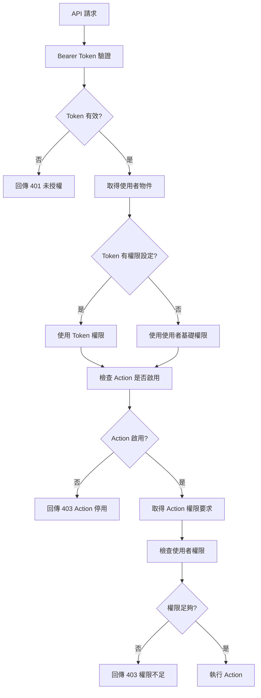

# 完整權限系統指南

## 目錄

1. [系統概述](#系統概述)
2. [權限架構](#權限架構)
3. [核心組件](#核心組件)
4. [權限層級](#權限層級)
5. [權限檢查流程](#權限檢查流程)
6. [Token 權限管理](#token-權限管理)
7. [使用者權限管理](#使用者權限管理)
8. [Action 權限配置](#action-權限配置)
9. [命令列工具](#命令列工具)
10. [API 使用範例](#api-使用範例)
11. [最佳實踐](#最佳實踐)
12. [故障排除](#故障排除)
13. [安全考量](#安全考量)

## 系統概述

本系統實作了一個多層級的權限控制機制，支援細粒度的 API 存取控制。系統採用以下設計原則：

- **多層級權限控制**：使用者基礎權限 + Token 限制權限 + Action 權限要求
- **最小權限原則**：Token 權限不會超過使用者基礎權限
- **靈活配置**：支援動態權限配置和繼承
- **安全優先**：預設拒絕，明確授權

## 權限架構

```
┌─────────────────────────────────────────────────────────────┐
│                    權限檢查流程                              │
├─────────────────────────────────────────────────────────────┤
│                                                             │
│  ┌─────────────┐    ┌─────────────┐    ┌─────────────┐     │
│  │ User        │    │ Token       │    │ Action      │     │
│  │ Permissions │───▶│ Permissions │───▶│ Required    │     │
│  │ (基礎權限)   │    │ (限制權限)   │    │ Permissions │     │
│  └─────────────┘    └─────────────┘    └─────────────┘     │
│         │                   │                   │          │
│         │                   │                   │          │
│         ▼                   ▼                   ▼          │
│  ┌─────────────────────────────────────────────────────┐   │
│  │            PermissionChecker                        │   │
│  │                                                     │   │
│  │  1. 檢查 Action 是否啟用                             │   │
│  │  2. 取得 Action 權限要求                             │   │
│  │  3. 取得使用者實際權限                               │   │
│  │  4. 驗證權限匹配                                     │   │
│  └─────────────────────────────────────────────────────┘   │
│                           │                                 │
│                           ▼                                 │
│                    ┌─────────────┐                         │
│                    │   允許/拒絕   │                         │
│                    └─────────────┘                         │
└─────────────────────────────────────────────────────────────┘
```

## 核心組件

### 1. PermissionChecker 服務

負責執行權限檢查的核心服務：

```php
namespace App\Services;

class PermissionChecker implements PermissionCheckerInterface
{
    public function canExecuteAction(User $user, ActionInterface $action): bool
    public function userHasPermissions(User $user, array $requiredPermissions): bool
    public function getUserPermissions(User $user): array
    // ... 其他方法
}
```

### 2. TokenService 服務

管理 Token 驗證和權限：

```php
namespace App\Services;

class TokenService
{
    public function validateToken(string $token): ?User
    public function createToken(User $user, string $name, array $permissions = [], ?Carbon $expiresAt = null): array
    // ... 其他方法
}
```

### 3. ActionPermission 模型

管理 Action 層級的權限配置：

```php
namespace App\Models;

class ActionPermission extends Model
{
    public static function findByActionType(string $actionType): ?self
    public function getPermissions(): array
    public function setPermissions(array $permissions): void
    // ... 其他方法
}
```

### 4. ApiToken 模型

管理 API Token 和其權限：

```php
namespace App\Models;

class ApiToken extends Model
{
    public function hasPermission(string $permission): bool
    public function isValid(): bool
    public static function findByToken(string $token): ?static
    // ... 其他方法
}
```

## 權限層級

### 第一層：使用者基礎權限 (User.permissions)

**用途：**
- 定義使用者的基礎權限範圍
- 由系統管理員根據使用者角色設定
- 作為權限的上限邊界

**範例：**
```php
// 管理員使用者
$user->permissions = [
    'admin.read',
    'admin.write', 
    'admin.delete',
    'system.server_status',
    'user.manage'
];

// 一般使用者
$user->permissions = [
    'user.read',
    'user.update',
    'user.change_password'
];
```

### 第二層：Token 限制權限 (Token.permissions)

**用途：**
- 對特定 Token 進行細粒度權限控制
- 實現最小權限原則
- 允許為不同用途的 Token 設定不同權限範圍

**權限覆蓋邏輯：**
```php
// TokenValidator.php
if ($user && $apiToken->permissions) {
    $user->permissions = $apiToken->permissions;  // Token 權限覆蓋
} 
// 否則使用 User.permissions（基礎權限）
```

### 第三層：Action 權限要求

**來源優先順序：**
1. 資料庫配置 (`action_permissions` 表)
2. Action 類別預設權限 (`getRequiredPermissions()` 方法)
3. 無權限要求（允許執行）

## 權限檢查流程



## Token 權限管理

### 建立 Token

#### 方法 1：使用命令列（推薦）

```bash
# 建立具有特定權限的 Token
php artisan token:manage create \
  --user=2 \
  --name="監控系統 Token" \
  --permissions=system.server_status \
  --permissions=admin.read \
  --days=30

# 建立無限制 Token（使用使用者基礎權限）
php artisan token:manage create \
  --user=2 \
  --name="完整權限 Token"

# 建立最小權限 Token
php artisan token:manage create \
  --user=2 \
  --name="唯讀 Token" \
  --permissions=user.info
```

#### 方法 2：使用程式碼

```php
// 建立限制權限的 Token
$tokenData = $tokenService->createToken(
    $user,
    '第三方整合 Token',
    ['user.info', 'user.update'],
    Carbon::now()->addDays(90)
);

// 建立管理員 Token
$tokenData = $tokenService->createAdminToken(
    $user,
    '管理員 Token',
    Carbon::now()->addYear()
);
```

### Token 權限範例

#### 場景 1：監控系統整合
```php
// 只需要查看系統狀態的權限
$permissions = [
    'system.server_status',
    'admin.read'
];
```

#### 場景 2：使用者管理系統
```php
// 需要管理使用者的權限
$permissions = [
    'user.read',
    'user.update',
    'user.list'
];
```

#### 場景 3：第三方應用整合
```php
// 最小權限，只能查看基本資訊
$permissions = [
    'user.info'
];
```

### Token 管理命令

```bash
# 查看 Token 資訊
php artisan token:manage info --token="your-token-here"

# 列出使用者的所有 Token
php artisan token:manage list --user=2

# 撤銷特定 Token
php artisan token:manage revoke --token="your-token-here"

# 撤銷使用者的所有 Token
php artisan token:manage revoke --user=2

# 清理過期的 Token
php artisan token:manage cleanup
```

## 使用者權限管理

### 權限類型定義

```php
// 使用者相關權限
'user.read'           // 讀取使用者資訊
'user.update'         // 更新使用者資料
'user.list'           // 列出使用者清單
'user.create'         // 建立新使用者
'user.delete'         // 刪除使用者
'user.change_password' // 修改密碼

// 管理員權限
'admin.read'          // 管理員讀取權限
'admin.write'         // 管理員寫入權限
'admin.delete'        // 管理員刪除權限

// 系統權限
'system.read'         // 系統資訊讀取
'system.server_status' // 伺服器狀態查詢
'system.config'       // 系統配置管理
```

### 使用者權限設定

```php
// 一般使用者
$user->permissions = [
    'user.read',
    'user.update',
    'user.change_password'
];

// 進階使用者
$user->permissions = [
    'user.read',
    'user.update',
    'user.change_password',
    'user.list',
    'system.read'
];

// 管理員使用者
$user->permissions = [
    'user.read', 'user.update', 'user.create', 'user.delete',
    'admin.read', 'admin.write', 'admin.delete',
    'system.read', 'system.server_status', 'system.config'
];
```

## Action 權限配置

### 在 Action 中定義預設權限

```php
class GetServerStatusAction extends BaseAction
{
    public function getRequiredPermissions(): array
    {
        return ['system.server_status'];
    }
    
    public function execute(Request $request, User $user): array
    {
        // Action 執行邏輯
    }
}
```

### 資料庫權限配置

```php
// 建立權限配置
ActionPermission::createOrUpdate(
    'system.server_status',
    ['system.server_status', 'admin.read'],
    '取得伺服器狀態（需要管理員權限）'
);

// 查詢權限配置
$config = ActionPermission::findByActionType('system.server_status');
$permissions = $config->getPermissions(); // ['system.server_status', 'admin.read']
```

### 權限配置檔案

```json
{
  "system.server_status": {
    "permissions": ["system.server_status", "admin.read"],
    "description": "取得伺服器狀態（需要管理員權限）",
    "is_active": true
  },
  "user.info": {
    "permissions": ["user.read"],
    "description": "取得使用者資訊",
    "is_active": true
  },
  "user.list": {
    "permissions": ["user.list", "admin.read"],
    "description": "取得使用者清單（需要管理員權限）",
    "is_active": true
  }
}
```

## 命令列工具

### Action 管理

```bash
# 列出所有已註冊的 Action
php artisan action:list

# 檢查特定 Action 的狀態
php artisan action:check system.server_status

# 重新整理 Action 註冊
php artisan action:refresh
```

### 權限管理

```bash
# 管理 Action 權限（如果有相關命令）
php artisan action:permissions list
php artisan action:permissions show system.server_status
php artisan action:permissions set system.server_status --permissions=system.server_status --permissions=admin.read
```

## API 使用範例

### 基本 API 呼叫

```bash
# 使用 Token 呼叫 API
curl -X POST http://localhost:8080/api/ \
  -H "Authorization: Bearer YOUR_TOKEN_HERE" \
  -H "Content-Type: application/json" \
  -d '{"action_type": "system.server_status"}'
```

### 成功回應

```json
{
  "status": "success",
  "message": "Action執行成功",
  "data": {
    "server_status": {
      "uptime": {"raw": "up 5 days", "status": "available"},
      "memory_usage": {"current": "128 MB", "peak": "256 MB"},
      "disk_usage": {"total": "100 GB", "used": "45 GB", "free": "55 GB"},
      "load_average": {"1min": 0.5, "5min": 0.3, "15min": 0.2}
    }
  },
  "timestamp": "2025-08-01T12:00:00.000Z",
  "request_id": "uuid-here"
}
```

### 權限不足回應

```json
{
  "status": "error",
  "message": "權限不足，無法執行此Action",
  "error_code": "INSUFFICIENT_PERMISSIONS",
  "details": [],
  "timestamp": "2025-08-01T12:00:00.000Z",
  "request_id": "uuid-here"
}
```

### Token 無效回應

```json
{
  "status": "error",
  "message": "無效或過期的 Bearer Token",
  "error_code": "UNAUTHORIZED",
  "timestamp": "2025-08-01T12:00:00.000Z"
}
```

## 最佳實踐

### 1. 權限設計原則

- **最小權限原則**：只給予執行必要功能的最小權限
- **職責分離**：不同角色使用不同的權限集合
- **定期審查**：定期檢查和更新權限配置
- **明確文檔**：為每個權限和 Action 提供清楚的說明

### 2. Token 管理

- **用途明確**：為每個 Token 設定明確的用途和名稱
- **權限最小化**：Token 權限應該是完成任務所需的最小權限集合
- **定期輪換**：定期更新和輪換 Token
- **監控使用**：監控 Token 的使用情況和異常存取

### 3. 安全考量

- **Token 保護**：妥善保管 Token，避免洩露
- **HTTPS 傳輸**：所有 API 呼叫都應使用 HTTPS
- **日誌記錄**：記錄權限檢查失敗和異常存取
- **定期清理**：清理過期和不使用的 Token

### 4. 開發建議

```php
// 好的做法：明確的權限定義
class GetUserListAction extends BaseAction
{
    public function getRequiredPermissions(): array
    {
        return ['user.list', 'admin.read'];
    }
}

// 避免：過於寬泛的權限
class SomeAction extends BaseAction
{
    public function getRequiredPermissions(): array
    {
        return ['*']; // 避免使用萬用權限
    }
}
```

## 故障排除

### 常見問題

#### 1. 權限檢查失敗

**症狀：** API 回傳 `INSUFFICIENT_PERMISSIONS` 錯誤

**檢查步驟：**
```bash
# 1. 檢查 Token 資訊
php artisan token:manage info --token="your-token"

# 2. 檢查 Action 權限要求
php artisan action:check system.server_status

# 3. 檢查使用者基礎權限
php artisan tinker
>>> $user = User::find(2);
>>> $user->permissions;
```

#### 2. Token 驗證失敗

**症狀：** API 回傳 `UNAUTHORIZED` 錯誤

**檢查步驟：**
```bash
# 檢查 Token 是否存在且有效
php artisan token:manage info --token="your-token"
```

#### 3. Action 找不到

**症狀：** API 回傳 `ACTION_NOT_FOUND` 錯誤

**解決方法：**
```bash
# 重新整理 Action 註冊
php artisan action:refresh

# 檢查 Action 是否正確註冊
php artisan action:list
```

### 除錯工具

```php
// 在 tinker 中除錯權限
php artisan tinker

// 檢查使用者權限
>>> $user = User::find(2);
>>> $user->permissions;

// 檢查 Token 權限
>>> $tokenService = app('App\Services\TokenService');
>>> $user = $tokenService->validateToken('your-token');
>>> $user->permissions;

// 檢查權限檢查邏輯
>>> $checker = app('App\Services\PermissionChecker');
>>> $action = app('App\Services\ActionRegistry')->resolve('system.server_status');
>>> $checker->canExecuteAction($user, $action);
```

### 日誌分析

檢查 Laravel 日誌檔案：
```bash
tail -f storage/logs/laravel.log | grep -E "(權限檢查|Permission|INSUFFICIENT_PERMISSIONS)"
```

常見的日誌訊息：
- `權限檢查完成`: 顯示權限檢查結果
- `使用者缺少權限`: 顯示缺少的具體權限
- `權限檢查失敗`: 記錄權限拒絕的詳細資訊

## 安全考量

### 1. Token 安全

- **儲存安全**：Token 應儲存在安全的地方，避免硬編碼在程式碼中
- **傳輸安全**：使用 HTTPS 傳輸 Token
- **生命週期管理**：設定適當的過期時間
- **撤銷機制**：提供快速撤銷 Token 的機制

### 2. 權限提升攻擊防護

- **權限邊界**：Token 權限不能超過使用者基礎權限
- **最小權限**：只給予必要的權限
- **權限驗證**：每次請求都進行權限驗證

### 3. 監控和審計

```php
// 記錄權限檢查失敗
Log::warning('權限檢查失敗', [
    'user_id' => $user->id,
    'action_type' => $actionType,
    'required_permissions' => $requiredPermissions,
    'user_permissions' => $userPermissions,
    'ip_address' => request()->ip(),
    'user_agent' => request()->userAgent(),
]);
```

### 4. 防護措施

- **速率限制**：對 API 請求實施速率限制
- **IP 白名單**：對敏感操作實施 IP 限制
- **異常檢測**：監控異常的權限存取模式
- **定期審計**：定期審查權限配置和使用情況

---

## 結語

本權限系統提供了靈活且安全的 API 存取控制機制。透過多層級的權限控制，您可以實現細粒度的存取管理，同時保持系統的安全性和可維護性。

如有任何問題或需要進一步的協助，請參考相關的技術文檔或聯繫系統管理員。